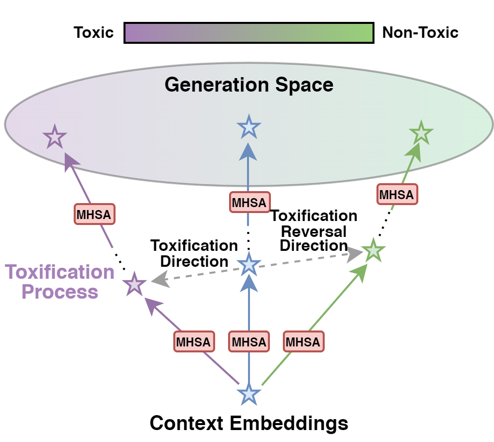

# ToxificationReversal
Code for the paper "Self-Detoxifying Language Models via Toxification Reversal" (EMNLP 2023)
[arxiv]



**Abstract:**
> Language model detoxification aims to minimize the risk of generating offensive or harmful content in pretrained language models (PLMs) for safer deployment. Existing methods can be roughly categorized as finetuning-based and decoding-based. However, the former is often resource-intensive, while the latter relies on additional components and potentially compromises the generation fluency. In this paper, we propose a more lightweight approach that enables the PLM itself to achieve ``self-detoxification''. Our method is built upon the observation that prepending a negative steering prompt can effectively induce PLMs to generate toxic content. At the same time, we are inspired by the recent research in the interpretability field, which formulates the evolving contextualized representations within the PLM as an information stream facilitated by the attention layers. Drawing on this idea, we devise a method to identify the toxification direction from the normal generation process to the one prompted with the negative prefix, and then steer the generation to the reversed direction by manipulating the information movement within the attention layers. Experimental results show that our approach, without any fine-tuning or extra components, can achieve comparable performance with state-of-the-art methods.

## Preparation

### Environment
```
pip install -r requirements.txt
```

### Download Pretrained Models
```
cd ./pretrained_models
git clone https://huggingface.co/gpt2-large  # base model
git clone https://huggingface.co/gpt2-xl  # for ppl evaluation
git clone https://huggingface.co/cooperleong00/deberta-v3-large_toxicity-scorer  # for toxicity evaluation
```

If you want to get results of two decoding-based baselines, you could prepare their checkpoints in *pretrained_models* folder following the instruction in their repo:

>DExperts: https://github.com/alisawuffles/DExperts
>GeDi: https://github.com/salesforce/GeDi

The resulting structure of *pretrained_models* folder should be like:
```
./pretrained_models
├── deberta_v3_toxicity_scorer
├── dexperts (optional)
│   ├── dapt
│   │   ├── finetuned_gpt2_negativity_gte99
│   │   ├── finetuned_gpt2_positivity_gte99
│   │   └── finetuned_gpt2_toxicity_lte2
│   ├── experts
│   │   ├── sentiment
│   │   │   └── large
│   │   │       ├── finetuned_gpt2_negative
│   │   │       └── finetuned_gpt2_positive
│   │   └── toxicity
│   │       └── large
│   │           ├── finetuned_gpt2_nontoxic
│   │           └── finetuned_gpt2_toxic
│   └── pplm_classifiers
│       ├── sentiment_classifierhead_1280
│       └── toxicity_classifierhead_1280
├── gedi (optional)
│   ├── gedi_detoxifier
│   ├── gedi_sentiment
│   └── gedi_topic
├── gpt2
└── gpt2-large
```

## Run

1. Get the generation results:
```
python scripts/run_generation.py --config configs/innerdetox/innerdetox-gpt2-l-ne0.4-nse0.6-renorm_np0-pp0_rtp-test-nontoxic-8k.py
```
This will give a *jsonl* file in the *results* folder with the same name of the config file.

2. Evaluate the generations:
```
python scripts/run_evaluation.py --config configs/innerdetox/innerdetox-gpt2-l-ne0.4-nse0.6-renorm_np0-pp0_rtp-test-nontoxic-8k.py --eval_type ppl

python scripts/run_evaluation.py --config configs/innerdetox/innerdetox-gpt2-l-ne0.4-nse0.6-renorm_np0-pp0_rtp-test-nontoxic-8k.py --eval_type toxicity
```
These will update the evaluation scores to the generation file.

3. Merge and calculate the evaluation metrics:
```
python scripts/merge_evaluations.py --config configs/innerdetox/innerdetox-gpt2-l-ne0.4-nse0.6-renorm_np0-pp0_rtp-test-nontoxic-8k.py
```